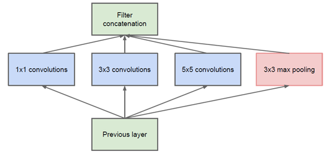
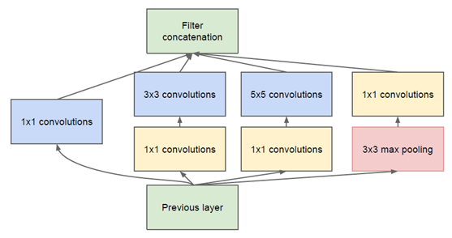

# **Inception_v1_v2**

## **Introduction** 
2014年，GoogLeNet获得当年ImageNet挑战赛(ILSVRC14)的第一名、GoogLeNet虽然深度只有22层，但大小却比AlexNet和VGG小很多，
GoogleNet参数为500万个，AlexNet参数个数是GoogleNet的12倍，VGGNet参数又是AlexNet的3倍，因此在内存或计算资源有限时，GoogleNet是比较好的选择；
从模型结果来看，GoogLeNet的性能却更加优越。 Inception系列就是GoogLeNet团队设计的一种 “基础神经元”结构，搭建了一个稀疏性、高计算性能的网络结构。
本文档着重介绍inception_v1和inception_v2。

## **Inception_v1**
最原始的inception结构如图所示，该结构将CNN中常用的卷积（1x1，3x3，5x5）、池化操作（3x3）堆叠在一起（卷积、池化后的尺寸相同，将通道相加），一方面增加了网络的宽度，另一方面也增加了网络对尺度的适应性。
不同尺寸的卷积层既能够提取输入特征的细节信息又可以增加特征提取的感受野，同时，池化操作用以减少空间大小，降低过度拟合。

然而Inception原始版本中，所有的卷积核都在上一层的所有输出上来做，而那个5x5的卷积核所需的计算量就太大了，造成了特征图的厚度很大，为了避免这种情况，在3x3前、5x5前、max pooling后分别加上了1x1的卷积核，以起到了降低特征图厚度的作用，这也就形成了Inception v1的网络结构，如下图所示：

1x1卷积核的作用：1x1卷积的主要目的是为了减少维度，还用于修正线性激活（ReLU）。比如，上一层的输出为100x100x128，经过具有256个通道的5x5卷积层之后(stride=1，padding=2)，输出数据为100x100x256，其中，卷积层的参数为128x5x5x256= 819200。而假如上一层输出先经过具有32个通道的1x1卷积层，再经过具有256个输出的5x5卷积层，那么输出数据仍为为100x100x256，但卷积参数量已经减少为128x1x1x32 + 32x5x5x256= 204800，大约减少了4倍。
基于Inception_v1构建了拥有22层的GoogLeNet，由于网络结构图过于庞大，如若感兴趣请查看[官方论文](http://arxiv.org/abs/1409.4842).

## **inception_v2**
大尺寸的卷积核可以带来更大的感受野，但也意味着会产生更多的参数，比如5x5卷积核的参数有25个，3x3卷积核的参数有9个，前者是后者的25/9=2.78倍。因此，GoogLeNet团队提出可以用2个连续的3x3卷积层组成的小网络来代替单个的5x5卷积层，即在保持感受野范围的同时又减少了参数量，如图所示：

接着，GoogLeNet又考虑是否可以以更小的卷积操作来代替3x3卷积呢，因此，他们又设计出如图下图所示的卷积，即用3个3x1代替一个3x3卷积。

因此，任意nxn的卷积都可以通过1xn卷积后接nx1卷积来替代。

# **MobileNet**

## **Introduction**
MobileNet是为移动端和嵌入式端深度学习应用设计的网络，使得网络结构在cpu上也能达到理想的速度要求。

## **MobileNet结构**
MobileNet网络结构如图所示：

